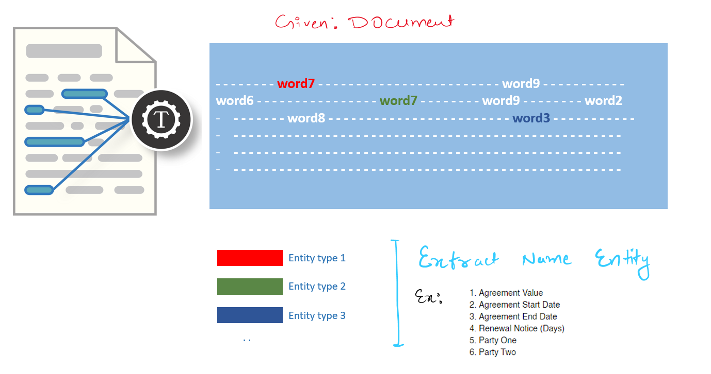

#### **Meta Data Extraction from Rental Agreements - Case Study**

#### Name - ADITYA ADARSH

#### LinkedIn - [https://www.linkedin.com/in/aditya-adarsh-657320188/](https://www.linkedin.com/in/aditya-adarsh-657320188/)

## 1. Problem Statement

#### Business Requirement - Overview

To build an AI/ML model to extract data from the rental agreements. The rental agreements will be in different data formats and available in the form of PDFs to perform the extraction.

The model should be able to extract the following fields from all the documents,

1.  Agreement Value
2.  Agreement Start Date
3.  Agreement End Date
4.  Renewal Notice (Days)
5.  Party One
6.  Party Two

## 2. Machine learning Formulation

#### Refer - Research Paper [https://arxiv.org/abs/2002.01861](https://arxiv.org/abs/2002.01861)

#### This problem can be solved using Name Entity Recognition - NLP

The named entity recognition (NER) is one of the most data pre-processing task. It involves the identification of key information in the text and classification into a set of predefined categories. An entity is basically the thing that is consistently talked about or refer to in the text.

NER is the form of NLP.

At its core, NLP is just a two-step process, below are the two steps that are involved:

-   Detecting the entities from the text
-   Classifying them into different categories

#### Some of the categories that are the most important architecture in NER such that:

-   Person
-   Organization
-   Place/ location

Source: [https://www.geeksforgeeks.org/named-entity-recognition](https://www.geeksforgeeks.org/named-entity-recognition)

## Approaches

### Approach 1 -

1.  Use pre-processed text and find the span of each entity in the rental-agreements docx text file using spacy pattern matcher.
2.  Convert the data into required format and finetune Spacy NER.

#### Observation -

1. Only 21.186 % entity is able to preserve in the training data when converted the data into spacy required format using spacy patter matcher.
2. Clearly spacy patter matcher is not able to annotate the entity properly.
3. Let's see how training validation is performing on this half-baked annotated data.

### Approach 2 -

1.  Use pretrained model which is trained on similar dataset.
2.  Perform pseudo annotation of training text and Val text.
3.  Use Pseudo annotated data for training and observe the prediction.

#### Observation -

1. Recall on pseudo annotated labelled data is dropped in approach 2 as compare to approach 1 but prediction on validation data is definitely improved.

2. Now, it is able to predict more than 'PARTY_ONE' and 'PARTY_TWO' entity field.

### Approach 3 -

1.  Manually annotate training and validation document using spacy annotator.
2.  Finetune Spacy-NER model and observe the performance.

##### Note: Manual annotating data could take some extra time but it would be worth exploring this experiment.

#### Observation -

1. Neither the recall of manually annotated validation data nor the prediction of validation data is up to mark.
2. Reason could be not able to annotate the data correctly.
3.  To verify this, redo the approach 3 again.

### **Conclusion**

* Approach 2 Seems to work best among all.
* If we annotate date properly then approach 3 might have better chance to perform well.

## Instructions to run the code-

*Install requirements.txt*

*Execute “workspace/code/Rental Agreement Metadata Extraction - ADITYA ADARSH.ipynb”*

####     Or 

**Want to train only model then follow below -**

Train model using approach – 2

*Run workspace/code/train_approach2.py*

	*python workspace/code/train_approach2.py*

Train model using approach – 3

*Run workspace/code/train_approach3.py*

	*python workspace/code/train_approach3.py*

####  END
